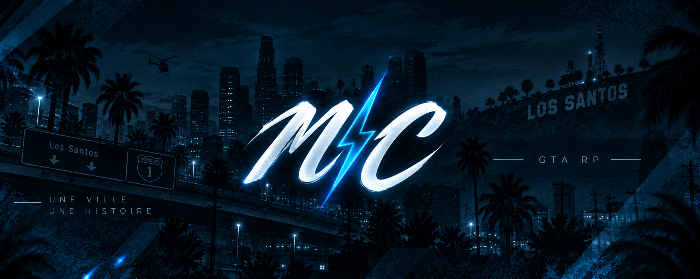

# 🌙 Bienvenue sur MoonCity

Bienvenue sur le **règlement officiel de MoonCity**.

Retrouvez ici l'ensemble des règles nécessaires pour évoluer sur le serveur dans un cadre RP cohérent, équitable et agréable pour tous.


**Le règlement est susceptible d'évoluer.** Chaque joueur doit consulter régulièrement les mises à jour publiées par l'équipe MoonCity.



**Sécurité :** aucun membre du staff MoonCity ne vous demandera votre mot de passe, vos identifiants personnels ou vos informations bancaires.


***

## <mark style="color:purple;">Catégories</mark>


[🙏 Notions de bases](notions-de-base/README.md)



[👨‍⚖️ Règlement Légal](reglement-legal/README.md)



[🥷 Règlement Illégal](reglement-illegal/README.md)



[🛡️ Sanctions & Support](sanctions-et-support.md)


***

## <mark style="color:purple;">L'esprit MoonCity</mark>

MoonCity privilégie les **interactions**, la **construction de scènes**, les **conséquences RP** et le **fair-play**. Une règle ne doit jamais servir à chercher une faille ou à contourner l'esprit du serveur.


En cas de doute sur une situation, privilégiez le bon sens, la cohérence de votre personnage et la qualité de la scène. Le staff reste décisionnaire pour les cas non prévus par le règlement.


---

**MoonCity — Règlement officiel — Version 1.1**
